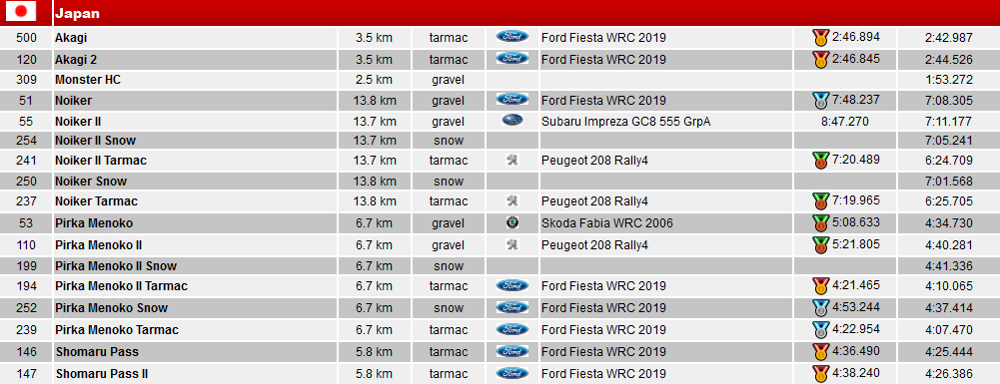
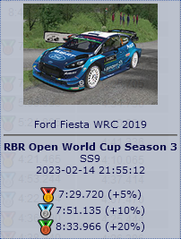

# RSF Medals: A browser extension for the Rally Sim Fans website
*Copyright 2024 Fixfactory*

## Overview

RSF Medals is a browser extension for Firefox and Chrome that enhances the [Rally Sim Fans website](https://rallysimfans.hu/) by displaying medal icons next to the user's best times.

## How To Get It

[Get Firefox extension](https://addons.mozilla.org/en-US/firefox/addon/rsf-medals/)

## How to Use

Simply install the extension then, when you visit your [user stats](https://rallysimfans.hu/rbr/usersstats.php) page of the [Rally Sim Fans website](https://rallysimfans.hu/), medal icons will appear next to your personal record times that qualify for a medal. To see the target times, move your mouse over the personal record time.

1. Install the extension
2. Visit the [Rally Sim Fans website](https://rallysimfans.hu/) and login to your account
3. Navigate to the [user stats](https://rallysimfans.hu/rbr/usersstats.php) page
4. Click the "Show record times" button

## Screenshots

  

  

